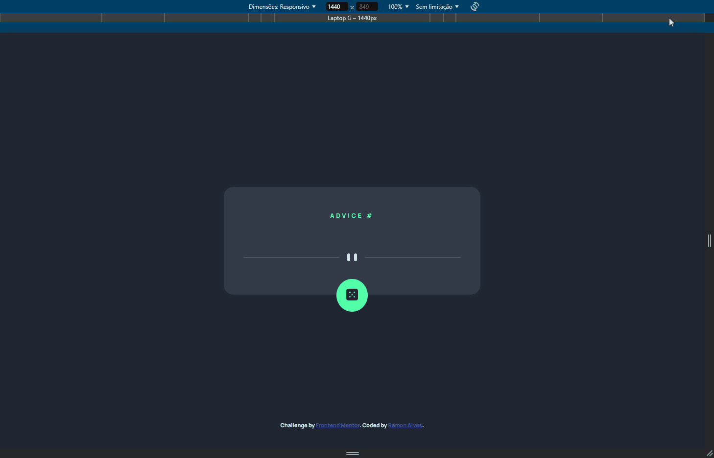
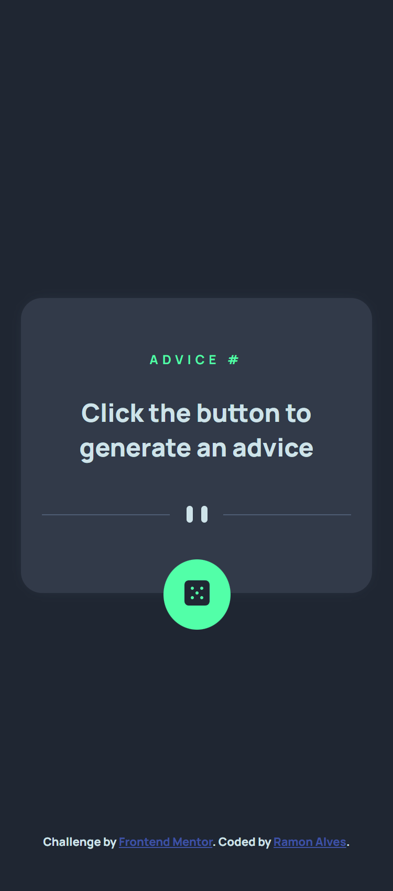

# Frontend Mentor - Advice generator app solution

This is a solution to the [Advice generator app challenge on Frontend Mentor](https://www.frontendmentor.io/challenges/advice-generator-app-QdUG-13db). Frontend Mentor challenges help you improve your coding skills by building realistic projects.

## Table of contents 📖

- [Overview](#overview)
  - [The challenge](#the-challenge)
  - [Screenshot](#screenshot)
  - [Links](#links)
- [My process](#my-process)
  - [Built with](#built-with)
  - [What I learned](#what-i-learned)
    - [Update 22/01/2025](#update-22.01.2025)
  - [Continued development](#continued-development)
  - [Useful resources](#useful-resources)
- [Author](#author)
- [Acknowledgments](#acknowledgments)


## Overview 🔭

### The challenge 🏆

Users should be able to:

- View the optimal layout for the app depending on their device's screen size
- See hover states for all interactive elements on the page
- Generate a new piece of advice by clicking the dice icon

### Screenshot 🎴



### Links 🔗

- Solution URL: [FrontEnd Mentor](https://github.com/Ramon-Alvez/FrontEnd-Mentor-Advice-Generator-App)
- Live Site URL: [Site](https://ramon-alvez.github.io/FrontEnd-Mentor-Advice-Generator-App/)

## My process 💻✒

### Built with 🧱🛠

- Semantic HTML5 markup
- CSS custom properties
- Flexbox
- JS
- [Advice Slip API](https://api.adviceslip.com/)

### What I learned 📚

I learned how to work with an API and improved my knowledge about JS.

  Its simplier but I'm really proud of this func because before I didn't understand how to use highOrder Functions, but now I got the idea. 

```js
async function printAdvice() {
  const searchedAdvice = await searchAdvice()
    const adviceID = searchedAdvice.slip.id
    const advice = searchedAdvice.slip.advice

    adviceNumber.innerText = `Advice #${adviceID}`
    adviceSection.innerText = `"${advice}"`
}
```

And, this is an exercise of a course I'm taking, after i saw the solution i read that i forgot to treat the possible errors that could in the code. 

Here is their solution:
```js
const adviceUpdateButton = document.querySelector(".advice-update");
const adviceNumber = document.querySelector(".advice-id");
const adviceDescription = document.querySelector(".advice-description");

async function getAdvice() {
  try {
    const response = await fetch("https://api.adviceslip.com/advice");

    /* 
      A propriedade .ok é responsável por verificar se a resposta (Response) foi feita com sucesso ou não, 
  
      nesse caso estamos negando a resposta, ou seja, se a resposta não foi feita com sucesso, retornamos um erro.
    
      Ela está presente no objeto Response, que é retornado pela função fetch. 
    */

    if (!response.ok){
      throw new Error("Ocorreu um erro ao tentar buscar as informações da API");
    }

    const adviceContent = await response.json();
    const adviceId = `Advice #${adviceContent.slip.id}`;
    const adviceText = `"${adviceContent.slip.advice}"`;

    adviceNumber.innerText = adviceId;
    adviceDescription.innerText = adviceText;

  } catch (error) {
    console.error("Erro ao tentar buscar as informações da API", error);
  }
  
}

adviceUpdateButton.addEventListener("click", getAdvice);

getAdvice();
```

#### Update 22.01.2025

Yesterday when I post my solution, Jay Khatri sent me a feedback with improvements I could make on the code, I decided to do what him told me and that's why this Update is comming. 

First I made a message in the advice container telling the user to "click the button" to generate an advice; 



Second I improve my function with "try" and "catch" and disabled the button to not overcharge the server with multiple API calls; 

```js
async function searchAdvice() {
    const url = "https://api.adviceslip.com/advice"
    const response = await fetch(url)
    
    if (!response.ok) throw new Error("An error occurred while trying to fetch information from the API");

    return await response.json() 
}

async function printAdvice() {
  diceButton.disabled = true

  try {
    ...
  }
  catch (error) {
    console.error("Error trying to fetch API information", error);
  }
  finally {
    diceButton.disabled = false
  }
}
```

And at last I made a simple loading screen when the API generate the advices, I really don't know how to do animations but I pretend to study this too.

```css
#card #loading {
    position: relative;
    top: -2rem;
    width: 4rem;
    height: 4rem;
    border: 0.8rem dotted var(--loading1);
    border-right-color: var(--loading2);
    border-top-color: var(--loading3);
    border-radius: 50%;

    animation: loading 2s infinite linear;
}
@keyframes loading {
    to {
        transform: rotate(1turn);
    }
}
#card #loading.hidden {
    display: none;
}
```

### Continued development 🚀

I just finished my JS advanced course but there are still other topics missing regarding js, such as jest, react, redux, etc... 

When I finish this, I will came here to do the other challenges.

### Useful resources 🎒

- DevQuest class about fetch requisition

## Author 🧙‍♂️

- GitHub - [Ramon Alvez](https://github.com/Ramon-Alvez/Frontend-Mentor-HTML-CSS-Intermediate-ChatApp-CSS-illustration)
- Frontend Mentor - [@Ramon Alvez](https://www.frontendmentor.io/solutions/-html5-e-css-22-1-intermediate-chat-app-illustration-qRIT2_JeKy)
- LinkedIn - [@Ramon Alvez](https://www.linkedin.com/in/ramon-alvez/)

## Acknowledgments 🔎

Thank you [Jay Khatri](https://www.frontendmentor.io/profile/khatri2002), I really really apreciate your help!